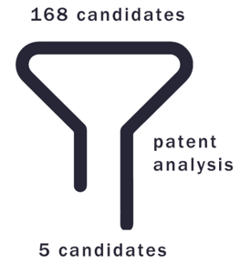
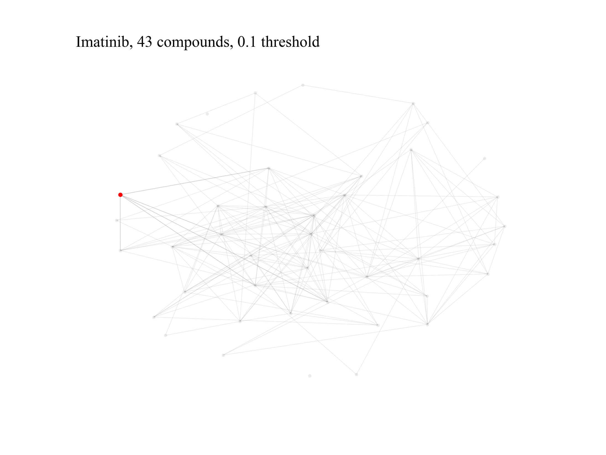

# Identifying Preclinical Candidates in Patents based on Network Science and Machine Learning 

## Table of Contents

- [Introduction](#introduction)
- [File Description](#file-description)
- [Network Example](#network-example)
- [Usage](#usage)
  - [Model Training and Hyperparameter Selection](#model-training-and-hyperparameter-selection)
  - [Validation Set Performance Testing](#validation-set-performance-testing)
- [Data](#data)
- [Contributors](#contributors)
- [License](#license)

## Introduction

Yicong DING (University of Macau, master thesis)

This repository aims to provide detailed code for my thesis, allowing users to optimize the model's performance by adjusting various hyperparameters. We also provide a separate script for testing the model's performance on a validation set after selecting the best hyperparameters.

## File Description

- `model.ipynb`: Contains the detailed code for the model, where users can choose and test various hyperparameters.
- `external_measure.ipynb`: Used to test the model's performance on a validation set after selecting the best hyperparameters.

## Network Example

## Usage

### Model Training and Hyperparameter Selection

1. Open and run `model.ipynb`.
2. Adjust the hyperparameters as needed and train the model.
3. Save the best hyperparameter settings.

### Validation Set Performance Testing

1. Open and run `external_measure.ipynb`.
2. Use the best hyperparameters selected in `model.ipynb` to test the model on the validation set.
3. Evaluate and record the model's performance on the validation set.

## Data

All related data (including datasets and network diagrams) can be found at the following link: [Project Data Link](https://drive.google.com/drive/folders/1uPnhdctQK4qsNEmGkpP4dNkZsKOkkYVz?usp=sharing).

## Contributors

Thanks to all contributors to this project, especially my supervisors Defang OUYANG and Yuanjia HU.

## License

This project is my master thesis and no one can copy in any form without my permission!!!
